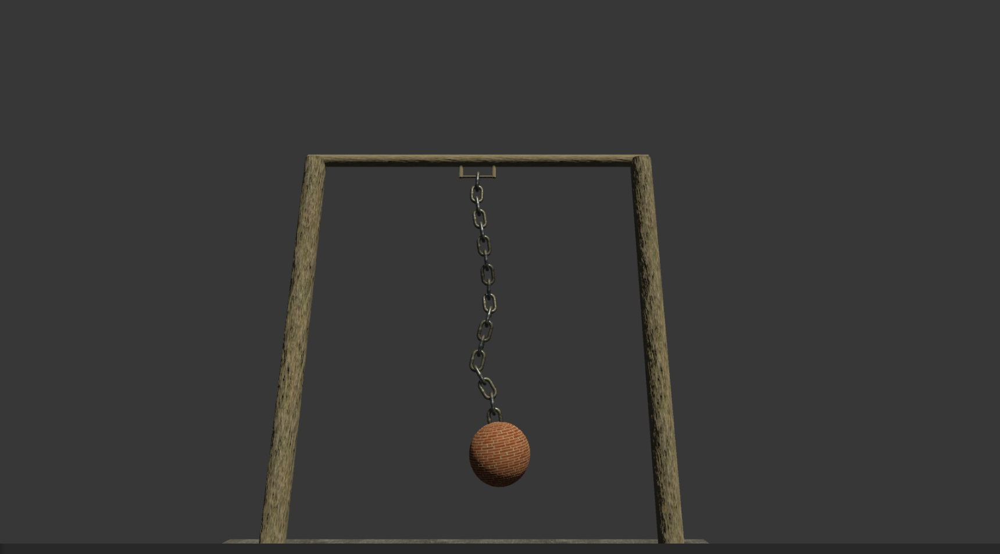
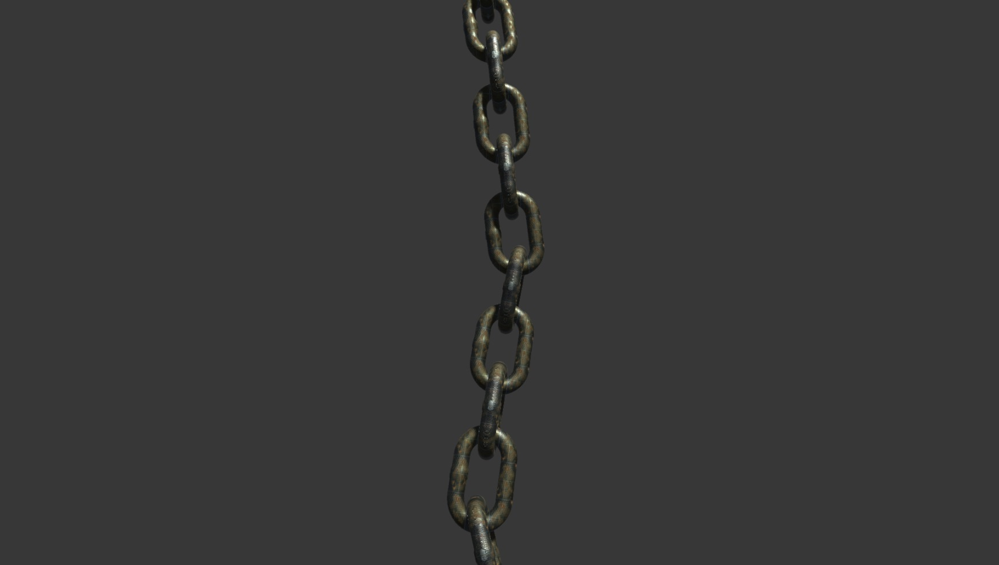
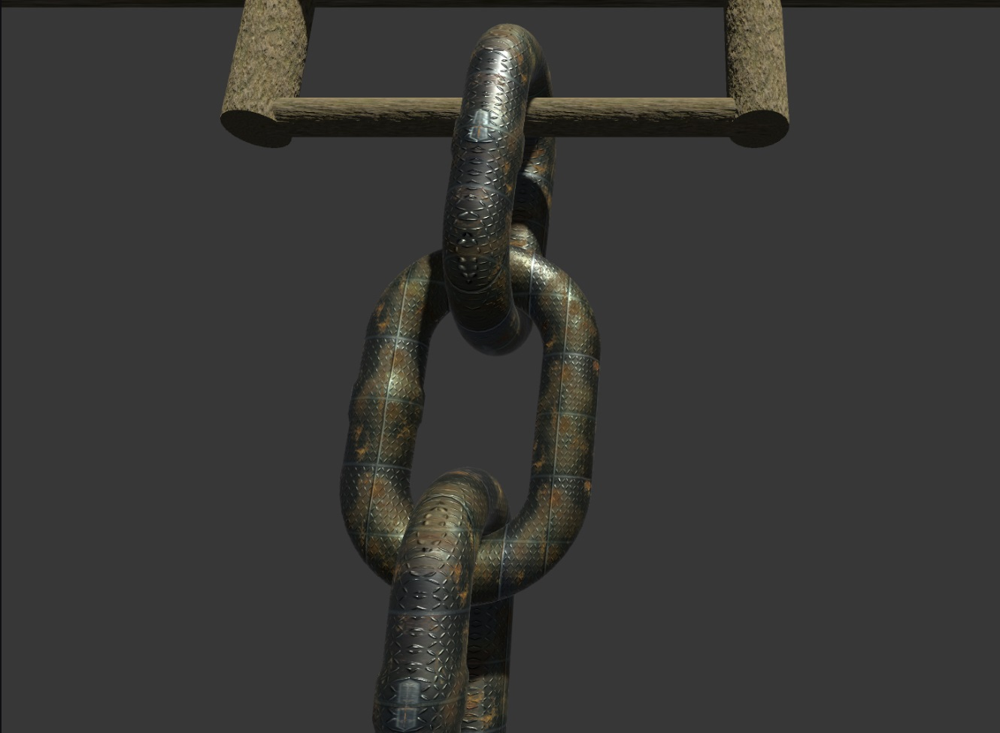

# Chain Physics — Unity-проект с реалистичной цепью

Chain Physics — демонстрация физического поведения цепи в Unity, где шар подвешен на металлической цепи. Используются разные типы джойнтов (`Hinge Joint`, `Spring Joint`) и компоненты физики (`Rigidbody`), чтобы добиться реалистичного качания, натяжения и реакции на внешние силы.

---

## Особенности проекта

- Шар висит на цепи, состоящей из звеньев с джойнтами.
- Используется Hinge Joint для имитации шарниров между звеньями.
- Дополнительно применён Spring Joint или настройки массы для физического натяжения.
- Все звенья и шар имеют компоненты Rigidbody и Collider.
- Цепь реалистично колышется и тянет шар.
- Материалы добавлены для визуального эффекта металла и тяжести.

---

## Используемые компоненты

- Rigidbody — у каждого звена и у шара.
- Hinge Joint — связывает звенья между собой, ограничивает вращение.
- Spring Joint (опционально) — добавляет пружинящий эффект между звеньями.
- Sphere Collider / Capsule Collider — для корректного столкновения.
- Physics Materials — для настройки трения и отскока.

---

## Как это работает

Цепь строится из префаба звена, которые соединяются последовательно через Hinge Joint. Последнее звено соединяется с шаром. На все объекты действует гравитация, и цепь реагирует на движение, колебания и столкновения.

---

## Как запустить

1. Клонируй репозиторий:
   ```bash
   git clone https://github.com/your_username/ChainPhysics
2. Открой проект в Unity (рекомендуемая версия: 2021.3+).
3. Запусти сцену SampleScene и нажми Play.
